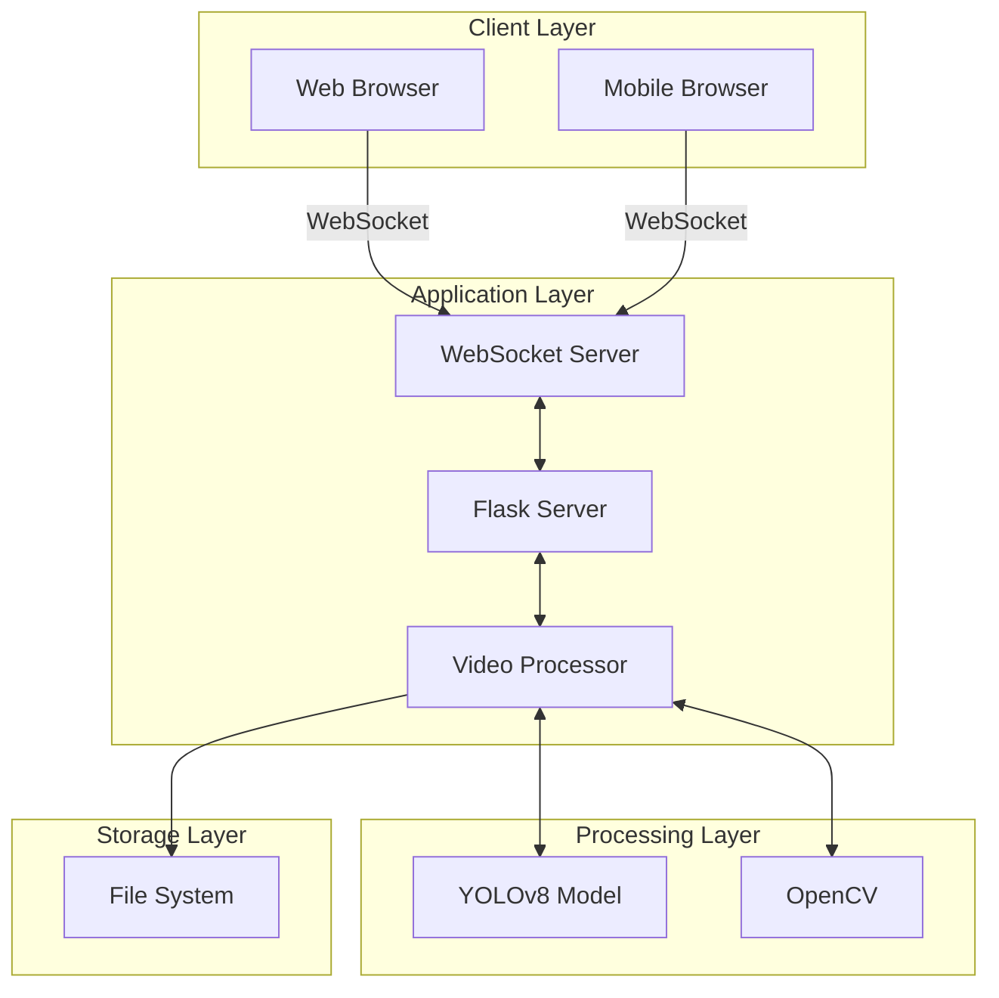

# Real-time Face Detection Streaming Platform


A high-performance, real-time face detection and streaming platform built with Flask and YOLOv8, supporting multi-user interaction and video recording capabilities.

## 📚 Contents

1. [Overview](#overview)
2. [Features](#features)
3. [Architecture](#architecture)
4. [Performance](#performance)
5. [Technology Stack](#technology-stack)
6. [Setup Guide](#setup-guide)
7. [Demo](#Demo)
8. [Configuration](#configuration)
9. [API Reference](#api-reference)
10. [Contributing](#contributing)

## Overview

The Real-time Face Detection Streaming Platform is an enterprise-grade solution that combines advanced computer vision capabilities with real-time web streaming. It enables multiple users to simultaneously connect to a video stream with integrated face detection, while providing interactive features such as live chat and video recording.

## Features

### 🎯 Core Capabilities
- **Real-time Face Detection**
  - YOLOv8-powered detection engine
  - Configurable confidence thresholds
  - Visual detection indicators
  - Performance-optimized processing

- **Multi-user Streaming**
  - Concurrent viewer support
  - Real-time user statistics
  - Automatic stream quality adjustment

- **Video Recording**
  - Start/stop recording functionality
  - Multiple format support
  - Configurable storage options

- **Interactive Chat**
  - Real-time message broadcasting
  - User presence tracking
  - System notifications

## Architecture



## Performance

| Mode | Metric | Value | Impact |
|------|--------|-------|---------|
| 🟦 No Detection | FPS<br>Latency<br>CPU Usage | 30 fps<br>33 ms<br>15% | Baseline |
| 🟩 Face Detection | FPS<br>Latency<br>CPU Usage | 25 fps<br>40 ms<br>35% | -5 fps<br>+7 ms<br>+20% CPU |
| 🟨 Detection + Recording | FPS<br>Latency<br>CPU Usage | 22 fps<br>45 ms<br>45% | -8 fps<br>+12 ms<br>+30% CPU |

## Technology Stack

### Backend Components
| Component | Technology | Purpose |
|-----------|------------|----------|
| Web Server | Flask 2.0+ | Application hosting |
| WebSocket | Flask-SocketIO | Real-time communication |
| ML Model | YOLOv8 | Face detection |
| Video Processing | OpenCV 4.5+ | Stream handling |

### Frontend Components
| Component | Technology | Purpose |
|-----------|------------|----------|
| UI Framework | Native JS | Core functionality |
| WebSocket Client | Socket.IO | Real-time updates |
| Styling | CSS3 Grid/Flexbox | Responsive design |

## Setup Guide

### Prerequisites
- Python 3.7 or higher
- Webcam device
- CUDA-compatible GPU (optional)

### Installation Steps

1. **Clone the repository**
```bash
git clone https://github.com/yourusername/face-detection-stream.git
cd face-detection-stream
```

2. **Set up virtual environment**
```bash
# Windows
python -m venv venv
venv\Scripts\activate

# Linux/macOS
python -m venv venv
source venv/bin/activate
```

3. **Install dependencies**
```bash
pip install -r requirements.txt
```

4. **Launch application**
```bash
python app.py
```

5. **Access the platform**
```
http://localhost:5000
```

### Project Structure
```
├── app.py              # Main Flask application
├── config.py           # Configuration settings
├── detector.py         # Face detection implementation
├── video_utils.py      # Video processing utilities
├── requirements.txt    # Project dependencies
├── static/
│   ├── uploads/        # Recording storage
│   ├── css/           # CSS files
│   └── js/            # JavaScript files
└── templates/
    └── index.html     # Main application template
```
## Demo

## Configuration

### Core Settings
```python
VIDEO_CONFIG = {
    'width': 640,
    'height': 480,
    'fps': 30
}

DETECTION_CONFIG = {
    'confidence': 0.5,
    'device': 'cuda if available else cpu'
}

SYSTEM_LIMITS = {
    'max_clients': 5,
    'max_file_size': 16MB,
    'allowed_extensions': ['jpg', 'jpeg', 'png', 'gif']
}
```

### Environment Variables
```plaintext
FLASK_ENV=development
FLASK_DEBUG=1
SECRET_KEY=your-secret-key
CORS_ORIGINS=http://localhost:3000
```

## API Reference

### WebSocket Events

| Event | Description |
|-------|-------------|
| `connect` | Client connection initialization |
| `user_joined` | New user joins the stream |
| `chat_message` | Chat message broadcast |
| `processed_frame` | Processed frame broadcast |
| `toggle_processing` | Toggle face detection |
| `start_recording` | Start video recording |
| `stop_recording` | Stop video recording |
| `disconnect` | Client disconnection handling |

## Contributing

We welcome contributions to the Real-time Face Detection Streaming Platform! To contribute:

1. Fork the repository
2. Create a feature branch
3. Implement changes
4. Submit pull request
